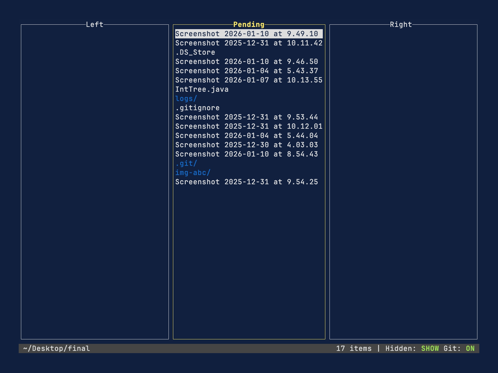

# ef

A simple file item sorter.

## Demo

## How to use

The main idea which `ef` is based on is the **binary sort**.
Open the dir you want to sort, then there will be three vertical lists: left, pending, right.
All you need to do is to move the items left or right, then press `enter` to start process then.
